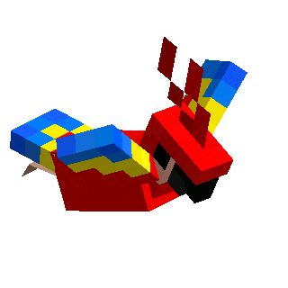

```assembly
section .data:
  Name: db  "Taha Ed-Dafili",  0
  Work: db  "student at 1337", 0
  Age:  dd  20
```

## **My GitHub/School Stats**
<a href="https://github.com/oakoudad/badge42"></a>
[](https://github.com/Ayg0/github-readme-stats)
<p align="center">
  <a href="https://github.com/Ayg0">
    
  </a>
</p>
<details>
<p align="center">
  <a href="https://github.com/Ayg0">
    
  </a>
  <a href="https://github.com/Ayg0">
    
  </a>
  <a href="https://github.com/Ayg0">
    
  </a>
</p>
</details>
